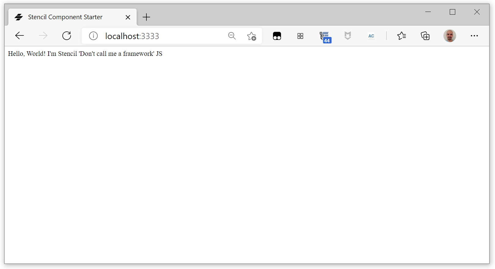
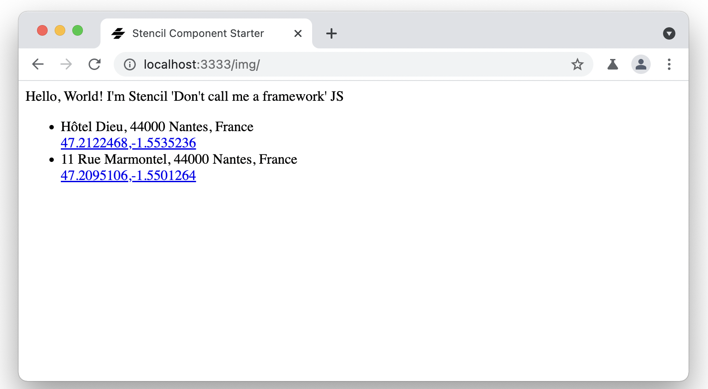

#   Stencil Street Art - Step 01: First steps with Stencil

This is the initial step of the tutorial. In this step, you're going to create your first Stencil component, and we will look at it together to understand it.

## Creating your Stencil component collection

Begin by creating a new Stencil component collection by doing:

```bash
npm init stencil
```

Stencil can be used to create standalone components, or entire apps. After running init you will be provided with a prompt so that you can choose the type of project to start. Please choose `component` to create your first Stencil component collection.

```bash
? Pick a starter › - Use arrow-keys. Return to submit.

   ionic-pwa     Everything you need to build fast, production ready PWAs
   app           Minimal starter for building a Stencil app or website
❯  component     Collection of web components that can be used anywhere
```

Call your component collection `stencil-street-art`.

```bash
✔ Pick a starter › component
✔ Project name › stencil-street-art

✔ All setup  in 25 ms

  $ npm start
    Starts the development server.

  $ npm run build
    Builds your components/app in production mode.

  $ npm test
    Starts the test runner.


  We suggest that you begin by typing:

   $ cd stencil-street-art
   $ npm install
   $ npm start

  Further reading:

   - https://github.com/ionic-team/stencil-component-starter

  Happy coding! 🎈
```

As the starter suggest, go to the newly created `stencil-street-art` folder, and run:

```bash
npm install
npm start
```

Then point your browser to the given URL and you should see your first Stencil component:

```bash
$ npm install
npm notice created a lockfile as package-lock.json. You should commit this file.
npm WARN stencil-street-art@0.0.1 No repository field.

added 1 package from 1 contributor and audited 1 package in 1.509s
found 0 vulnerabilities

$ npm start

> stencil-street-art@0.0.1 start /home/horacio/git/stencil-street-art/stencil-street-art
> stencil build --dev --watch --serve

[31:36.2]  @stencil/core
[31:36.5]  v2.9.0 🚙
[31:38.3]  build, stencil-street-art, dev mode, started ...
[31:38.4]  transpile started ...
[31:39.8]  transpile finished in 1.40 s
[31:39.8]  copy started ...
[31:39.8]  generate lazy started ...
[31:39.8]  copy finished (0 files) in 88 ms
[31:40.9]  generate lazy finished in 1.16 s
[31:40.9]  build finished, watching for changes... in 2.61 s

[31:41.0]  http://localhost:3333/
```



## How does it work?

If you look at the `stencil-street-art` folder, you will see the structure of a Stencil project. The source code is in the `src` folder:


All the components in this component collection are in the `src/components` folder, each one in its own subfolder. As you can see, we only have a component here, `my-component`.

### Anatomy of a Stencil Component

Each component has two main files, a TypeScript file (`my-component.tsx`in this example) and a CSS one (`my-component.css`). The `.tsx` extension is required since Stencil components are built using [JSX](https://facebook.github.io/react/docs/introducing-jsx.html) and TypeScript.

Let's look at the `my-component.tsx` file:

```tsx
import { Component, Prop, h } from '@stencil/core';
import { format } from '../../utils/utils';

@Component({
  tag: 'my-component',
  styleUrl: 'my-component.css',
  shadow: true,
})
export class MyComponent {
  /**
   * The first name
   */
  @Prop() first: string;

  /**
   * The middle name
   */
  @Prop() middle: string;

  /**
   * The last name
   */
  @Prop() last: string;

  private getText(): string {
    return format(this.first, this.middle, this.last);
  }

  render() {
    return <div>Hello, World! I'm {this.getText()}</div>;
  }
}
```

The first piece we see is the `@Component` decorator. This decorator provides metadata about our component to the Stencil compiler. Information, such as the tag to use, and external styles, can be set here and picked up by the compiler.

Below the `@Component()` decorator, we have a standard TypeScript class. This is where you'll write the bulk of your code to bring your Stencil component to life. Here is where you'd write functions or provide business logic.

In order for the component to render something to the screen, we must declare a render function that returns JSX. If you're not sure what JSX is, don't worry, we'll go over it later in the tutorial.

The quick idea is that our render function needs to return a representation of the HTML we want to push to the DOM.

The name property on the class also has a decorator applied to it, `@Prop()`. This decorator tells the compiler that the property is public to the component, and the user should be setting it. We set this property like so:

```html
<my-first-component name="Max"></my-first-component>
```

Any property decorated with `@Prop()` is also automatically watched for changes. If a user of our component were to change the element's name property, our component would fire its render function again, updating the displayed content.

### The entry point

The `index.ts` file loads 


The `index.html` file is the entry point of the application:

```html
<!DOCTYPE html>
<html dir="ltr" lang="en">
  <head>
    <meta charset="utf-8" />
    <meta name="viewport" content="width=device-width, initial-scale=1.0, minimum-scale=1.0, maximum-scale=5.0" />
    <title>Stencil Component Starter</title>

    <script type="module" src="/build/stencil-street-art.esm.js"></script>
    <script nomodule src="/build/stencil-street-art.js"></script>
  </head>
  <body>
    <my-component first="Stencil" last="'Don't call me a framework' JS"></my-component>
  </body>
</html>
```

As you see, it's rather simple: it loads a `stencil-street-art.esm.js` (or `stencil-street-art.js` in old browsers) that is generated by Stencil from the source `.ts` files, specially from the main `index.ts` file. This file loads the list of your defined components from the `components` folder.

Your Stencil components, once compiled, can be used in HTML just like any other tag:

```html
    <my-component first="Stencil" last="'Don't call me a framework' JS"></my-component>
```

## What must I do?

Add some street art sites to the `index.html` file:

```html
<div class="container">
    <ul>
    <li>
        <div class="location">Hôtel Dieu, 44000 Nantes, France</div>
        <div class="coordinates">
          <a href="https://www.google.com/maps/place/47%C2%B012'44.7%22N+1%C2%B033'13.3%22W/@47.2124167,-1.5542416,131m/">47.2122468,-1.5535236</a>
        </div>
    </li>
    <li>
        <div class="location">11 Rue Marmontel, 44000 Nantes, France</div>
        <div class="coordinates">
          <a href="https://www.google.com/maps/place/11+Rue+Marmontel,+44000+Nantes/@47.2094918,-1.5503709,19z/">47.2095106,-1.5501264</a>
        </div>
    </li>
    </ul>
</div>
```

And verify that the web application is updated:





## Additional experiments

Try adding more static HTML to `src/index.html`. For example:

```html
<p>Total number of street art sites: 2</p>
```

## Summary

You have created your first Stencil application, with your first Stencil component. We have added the skeleton for a street art app. To begin adding dynamism, go to [step-02](../step-02).    
