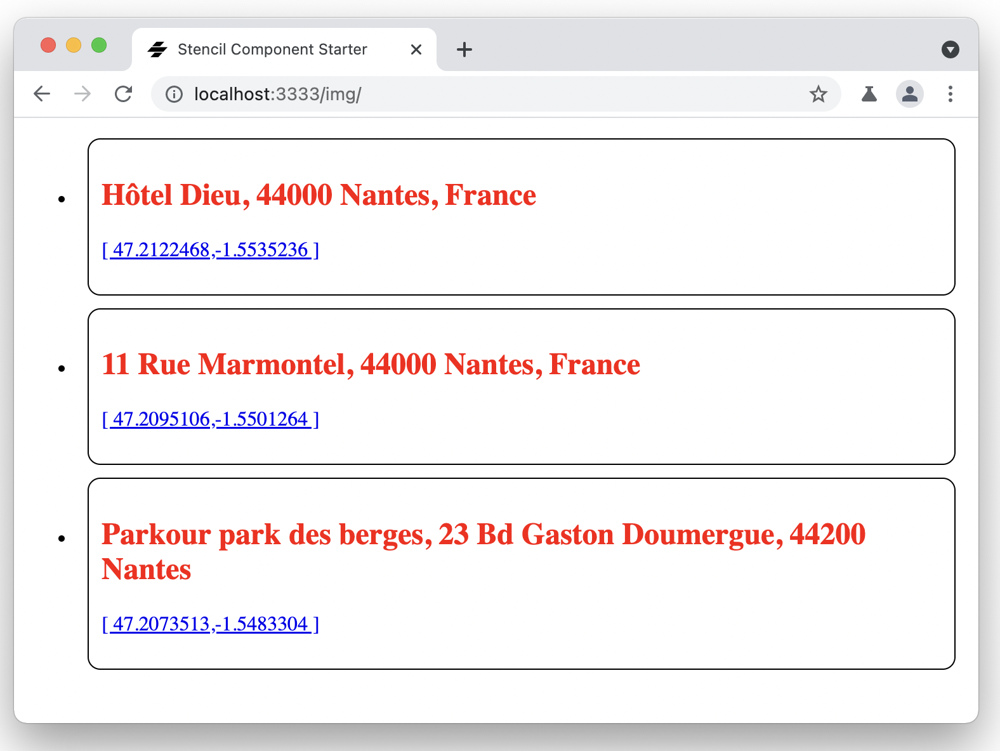
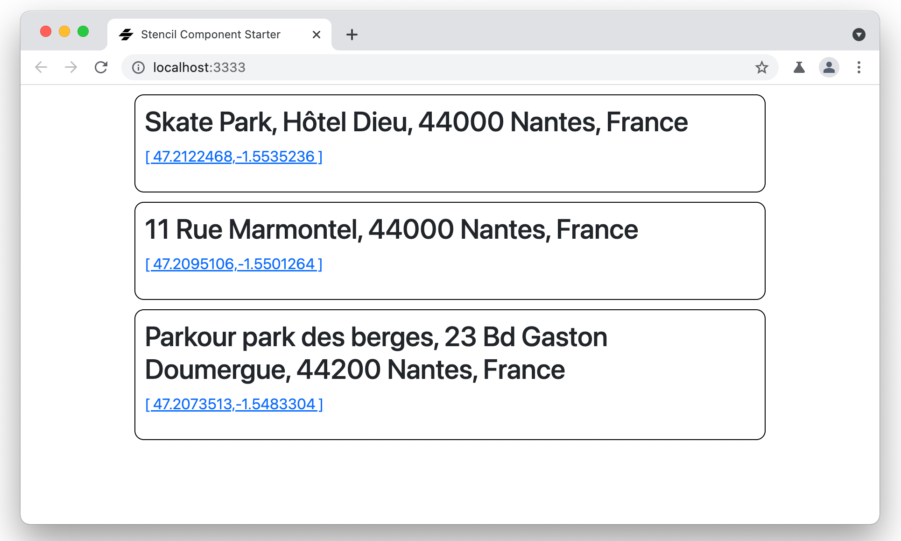

#   Stencil Street Art - Step 03: Creating and iterating a list


In this step we are going to create a more complex Stencil component, a custom `art-list`. This element will use a TypeScript array as model and automatically generate a `art-list-item` for each street art site in the array.


## Creating the component


Begin by creating a new folder fore the component, `src/components/art-list`. Inside it, create the TypeScript file to define the component, `art-list.tsx`, and the associated CSS file, `art-list.css`.


In the TypeScrip file, declare the component:


```tsx
import { Component, h } from '@stencil/core';

@Component({
  tag: 'art-list',
  styleUrl: 'art-list.css',
})
export class catalogue {
  render() {
      return <div></div>
  }
}
```


## Defining the model

We are going to model a street art site object as a `Art` TypeScript item, and our (ever growing) street art sites collection as a TypeScript array of `Art`.

In the `src/utils` folder, add a `art.ts` file:

```ts
export interface Art {
  location: string,
  coordinates: string,
  link: string,
}

export const catalogue: Array<Art> =  [
  {
    "coordinates": "[ 47.2122468,-1.5535236 ]",
    "location": "Skate Park, Hôtel Dieu, 44000 Nantes, France",
    "link": "https://goo.gl/maps/aXHMNvDtrDSDgQMHA"
  },
  {
    "coordinates": "[ 47.2095106,-1.5501264 ]",
    "location": "11 Rue Marmontel, 44000 Nantes, France",
    "link": "https://goo.gl/maps/ZrSou5t1aaGwnjUM7"
  },
  {
    "coordinates": "[ 47.2073513,-1.5483304 ]",
    "location": "Parkour park des berges, 23 Bd Gaston Doumergue, 44200 Nantes, France",
    "link": "https://goo.gl/maps/Fr7iqAcLNwoC9Q6k9"
  }
];
```


## Importing the model

Now we can import our `Art` type and the `catalogue` consta into the `art-list` component:

```tsx
import { Art, catalogue } from '../../utils/art';
```

And we are going to declare the street art sites list with the `@State` decorator. The `@State()` decorator is used to manage internal data for a component. Any changes to a `@State()` property will cause the components render function to be called again.

Import the `@State` decorator:

```tsx
import { Component, State, h } from '@stencil/core';
```

And add a street art sites list state to the component:

```tsx
  @State() artList: Array<Art>;
```

*For more information on the `@State` decorator, see the [official documentation](https://stenciljs.com/docs/state).*


## Initializing the state

In order to initialize the state, we are going to use the `componentWillLoad()` lifecycle method. 

Components have numerous lifecycle methods which can be used to know when the component "will" and "did" load, update, and render. These methods can be added to a component to hook into operations at the right time.

The `componentWillLoad()` method is called once just after the component is first connected to the DOM. Since this method is only called once, it's a good place to load data asynchronously.

Let's use it to initialize `artList`:

```tsx
  componentWillLoad() {
    this.artList = catalogue;
  }
```

*For more information on Stencil lifecycle methods, see the [official documentation](https://stenciljs.com/docs/component-lifecycle).*

## Iterating the list


Now we want that for each `Art` in `artList`, the `render()` method generates one `art-list-item` component, i.e. we need to create a loop in the `render()` method.

Loops can be created in JSX using array operators such as `map` when inlined in existing JSX. 

In our case:

```tsx
  render() {
    return <ul class="artList">
      {this.artList.map((art: Art) => {
        return <li>
          <art-list-item
            location={art.location}
            coordinates={art.coordinates}
            link={art.link}>
          </art-list-item>
        </li>;
      })}
    </ul>
  }
```

The [`map()`](https://developer.mozilla.org/en-US/docs/Web/JavaScript/Reference/Global_Objects/Array/map) array method creates a new array with the results of calling a provided function on every element in the calling array.

In this case, for each `art` in the `artList` list, it generates an `<art-list-item>` component.

Now we can use `art-list` in our `index.html`:

```html
<!DOCTYPE html>
<html dir="ltr" lang="en">
  <head>
    <meta charset="utf-8" />
    <meta name="viewport" content="width=device-width, initial-scale=1.0, minimum-scale=1.0, maximum-scale=5.0" />
    <title>Stencil Component Starter</title>

    <script type="module" src="/build/stencil-street-art.esm.js"></script>
    <script nomodule src="/build/stencil-street-art.js"></script>
  </head>
  <body>
    <art-list></art-list>
  </body>
</html>
```




## Making it prettier

Let's add some CSS code to `beer-list.css` to hide those bullet points before ever `beer-list-item`:

```css
.artList {
    list-style-type: none;
}
```

Now we are going to add some [Bootstrap](https://getbootstrap.com/) look and feel to your components. 

First of all, get Bootstrap 5 using `npm`:

```bash
npm i bootstrap@^5.1.3
```

Now edit your application global Stencil configuration file, `stencil.config.ts`, and add an optional `globalStyle` setting that points to the Bootstrap CSS:


```ts
export const config: Config = {
  namespace: 'stencil-street-art',
  globalStyle: 'node_modules/bootstrap/dist/css/bootstrap.min.css',
  [...]
}
```

The Stencil compiler will now run the same minification, autoprefixing and plugins over the global CSS file and generate an output file for the `www` and `dist` output targets. The generated file will always have the `.css` extension and be named as the specified namespace, i.e. in our case `stencil-street-art.css`.

We need to manually load this file in the `index.html` file:

```html
<link rel="stylesheet" href="/build/stencil-street-art.css">
```

We can now also add a `container` class to the `art-list` and `art-list-item` renderers:

```tsx
  render() {
    return <ul class="container artList">
      {this.artList.map((art: Art) => {
        return <li>
          <art-list-item
            location={art.location}
            coordinates={art.coordinates}
            link={art.link}>
          </art-list-item>
        </li>;
      })}
    </ul>
  }
```

```tsx
  render() {
    return <div class="container art">
        <h2> {this.location} </h2>
        <p> <a href={this.link}>{this.coordinates}</a></p>
    </div>;
  }
```

So now the street art site are rendered inside a Bootstrap [container](https://getbootstrap.com/docs/4.1/layout/overview/#containers) element, as you can see with the margins.




## Aditionnal experiments

### Make the `beer-list` element show the number of beers in the list.

In the `beer-list` renderer you have access to the beers variable, you can then get it's size and show it after the beers:

```tsx
<div>Number of beers in list: {this.beers.length}</div>
```

### Play with loops

Create a loop in `beer-list` that constructs a simple table:

```tsx
<table>
  <tr><th>Row number</th></tr>
  {[0, 1, 2, 3, 4, 5, 6, 7].map((item) => <tr><td>{item}</td></tr>)}
</table>
```

Extra points: try and make an 8x8 table using an additional loop.


## Summary ##

You now have a web application using Stencil web components.
Now, let's go to [step-04](../step-04/) to learn how to add full text search to the app.
