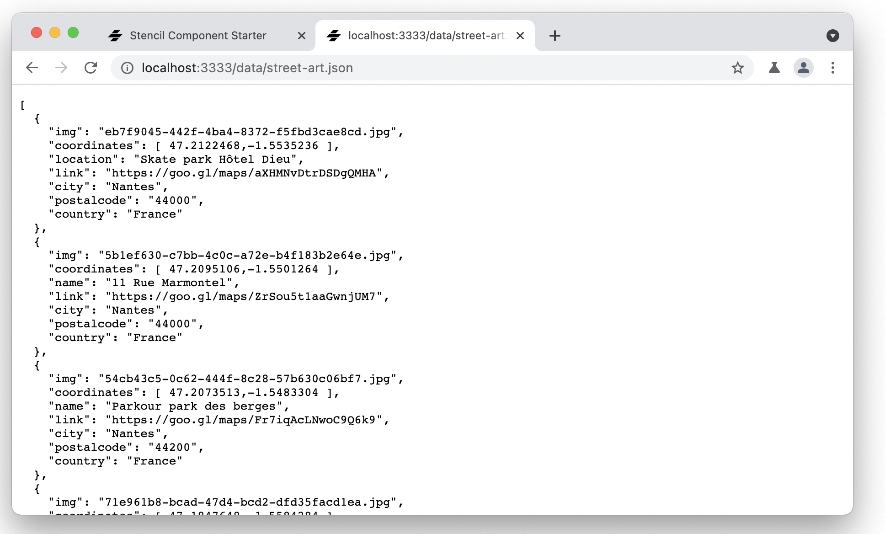
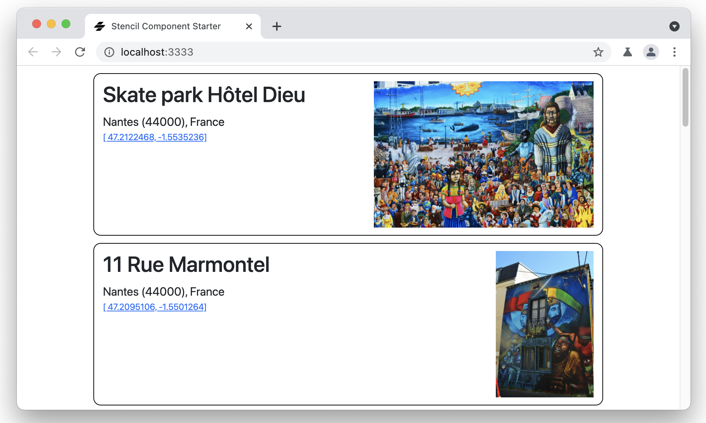

#   Stencil Street Art - Step 04: Calling the server


Enough of building an app with five beers in a hard-coded dataset! Let's fetch a larger dataset from our server using the [JavaScript Fetch API](https://developer.mozilla.org/en-US/docs/Web/API/Fetch_API).

## Data 

Our new dataset is now a list of 11 street art sites stored in JSON format in the `/data/street-art.json`, and their associated images in `data/img/`. Begin by copying `/data` to a `src/data` inside your application.

Now you need to tell Stencil to copy the `src/data` folder into the distribution folder, i.e. to make it available to the compiled application. To do it, open your application's global Stencil configuration file `stencil.config.ts`, and add the `copy` tasks:

```tsx
import { Config } from '@stencil/core';

export const config: Config = {
  namespace: 'stencil-beers',
  globalStyle: 'node_modules/bootstrap/dist/css/bootstrap.min.css',
  outputTargets: [
    {
      type: 'dist',
      esmLoaderPath: '../loader',
      copy: [
        { src: 'data' }
      ],
    },
    {
      type: 'dist-custom-elements-bundle',
    },
    {
      type: 'docs-readme',
    },
    {
      type: 'www',
      serviceWorker: null, // disable service workers
      copy: [
        { src: 'data' }
      ],
    },
  ],
};
```

Now the JSON file is available to your browser at the URL `http://127.0.0.1:3333/data/street-art.json`.





## Updating the model

As you can see, the model has evolved from previous steps:

```json
...
  {
    "img": "eb7f9045-442f-4ba4-8372-f5fbd3cae8cd.jpg",
    "coordinates": [ 47.2122468,-1.5535236 ],
    "location": "Skate park Hôtel Dieu",
    "link": "https://goo.gl/maps/aXHMNvDtrDSDgQMHA",
    "city": "Nantes",
    "postalcode": "44000",
    "country": "France"
  },
...
```

Some new fields have been added, and `coordinates` have changed from `string` to `Array<number>`. We will need to adapt the model on our application to reflect it.

In `src/utils/art.ts`, we update the definition of `Art` and eliminate the hardcoded `catalogue`:

```ts
export interface Art {
  img: string,
  location: string,
  coordinates: Array<number>,
  link: string,
  city: string,
  postalcode: string,
  country: string,
}
```

And in `art-list` we remove all references to `catalogue` and the initialisation of the street art sites list from it:

```tsx
import { Art } from '../../utils/art';

[...]

  componentWillLoad() {
  }

[...]  
```

We will need to modify our components to take account this evolution, but for it can mostly be done later. The only changement that we need to do now is to take account of the new definition of `coordinates` in the `render()` method of `art-list`:

```tsx
  render() {
    return <ul class="artList container">
      {this.artList.map((art: Art) => {
        return <li>
          <art-list-item
            location={art.location}
            coordinates={`[ ${art.coordinates[0]}, ${art.coordinates[1]} ]`}
            link={art.link}>
          </art-list-item>
        </li>;
      })}
    </ul>
  }
```  

## Fetch API

To get the JSON data from the server we are using the [JavaScript Fetch API](https://developer.mozilla.org/en-US/docs/Web/API/Fetch_API) to make an HTTP GET request to our web server, asking for `/data/street-art.json`. The server responds by providing the data in the JSON file. (The response might just as well have been dynamically generated by a backend server. To the browser and our app they both look the same. For the sake of simplicity we used a JSON file in this tutorial).

As the `fetch` operation is asynchronous, we are using the [`async/await`](https://developer.mozilla.org/en-US/docs/Web/JavaScript/Reference/Statements/async_function) syntax make the asynchronous code easier to read and write.

We want to call for the data as soon as our `art-list` element get loaded, so we use `componentWillLoad()`. We are going to make it `async`, as explaioned just before:

```tsx
    async componentWillLoad() {
        try {
            const response = await fetch('/data/street-art.json');
            this.artList = await response.json();
        }
        catch (err) {
            console.log('fetch failed', err);
        }
    }
```
And now you should have 11 street art sites in your collection:


## Showing more information

As now we recover more information for each site (the city, postal code and country, and an image link, of course!), we are going to modify `art-list-item` element to show it.

We begin by adding the missing properties:

```tsx

  @Prop() img: string;
  @Prop() location: string;
  @Prop() coordinates: Array<number>;
  @Prop() link: string;
  @Prop() city: string;
  @Prop() postalcode: string;
  @Prop() country: string;
```

Then we modify the `render()` method, displaying more information on each site:

```tsx
  render() {
    return <div class="container clearfix art">                     
      <a href={"./data/img/" + this.img} target="_blank">
        </img>
      </a>
      <h2 class="location">{this.location}</h2>
      <div class="address">
        {this.city} ({this.postalcode}), {this.country}
      </div>
      <div class="coordinates">
        <a href={this.link} target="_blank">[ {this.coordinates[0]}, {this.coordinates[1]}]</a>
      </div>
    </div>;
  }
```

And we add some CSS TO `art-list-item.css` to make things prettier:

```css
.art {
    margin: 10px;
    padding: 10px;
    border: solid 1px black;
    border-radius: 10px;
    min-height: 50px;
}

.location {
    margin-top: 0;
}

.address {
    margin-right: 16px;
}

.coordinates {
  font-size: 0.75rem;
}

.main-img {
    max-height: 200px;
}
```

## Mapping the new information

In order to `art-list-item` being able to display this new information, we also need to modify `art-list` to map the information for each `art-list-item`. Let's modify the `render()` method of `art-list`:

```tsx
  render() {
    return <ul class="artList container">
      {this.artList.map((art: Art) => {
        return <li>
          <art-list-item
            img={art.img}
            location={art.location}
            coordinates={art.coordinates}
            link={art.link}
            city={art.city}
            postalcode={art.postalcode}
            country={art.country}>
          </art-list-item>
        </li>;
      })}
    </ul>
  }
```



## Summary ##

Now that you have loaded beer data from a server-side JSON file, go to [step 5](../step-05) to learn how to add full text search to the app.
